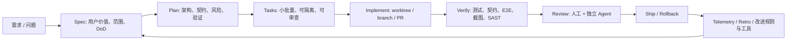

# 企业级 AI Agent 协作开发调研与 FPG 差距评估

> 日期：2026-06-27
> 目标：为企业推广 Codex、Claude Code、Qoder/通义灵码、TRAE、CodeBuddy 等 AI Agent 辅助开发工具，形成可落地的方法论、团队组织、度量体系、风险控制和 FPG 改进方向。
> 方法：优先引用官方文档、官方博客、DORA/Google 研究、厂商产品文档；媒体稿和二手案例只作为启发，不作为强证据。

---

## 0. 结论摘要

企业级 AI Agent 辅助开发不能按“买工具 -> 人人使用 -> 自动提效”推进。OpenAI、Anthropic、Google/DORA 与国内厂商材料共同指向一个更保守但更可靠的结论：

1. **AI 是放大器，不是流程替代品**：Google DORA 2025 明确把 AI 成功归因到组织能力，包括清晰 AI 政策、健康数据生态、AI 可访问内部数据、强版本控制、小批量交付、用户中心和高质量内部平台。[S12]
2. **高质量产出来自可执行环境，而非更长提示词**：OpenAI Harness Engineering 的关键经验是把仓库知识作为事实源、用短 AGENTS.md 做地图、用结构化 docs/plan/linters/CI 机械约束 Agent。[S1]
3. **Agent 工作流必须可验证**：Anthropic Claude Code 官方最佳实践把“给 Claude 一个可运行检查”放在首位，建议用测试、构建、截图、Stop hook、独立 verifier/subagent 形成闭环。[S3]
4. **多 Agent 不是默认答案**：Anthropic 多 Agent 研究显示，适合多 Agent 的任务是高价值、可并行、信息空间大、工具复杂的任务；多 Agent 研究系统约 15 倍于普通聊天 token，且多数编码任务不如研究任务容易并行。[S5]
5. **FPG 方向是对的，但还缺企业落地层**：当前 FPG 已有 Skill 流水线、AGENTS.md、E/S/T 迭代治理、telemetry hook、token/活跃耗时、fpg-check；主要缺口在项目管理系统集成、PR/CI/安全质量门禁、OpenTelemetry/LLM 网关成本治理、团队权限与审计、真实组织基线和复盘闭环。

---

## 1. 证据等级

| 等级 | 可采信方式 | 本文处理 |
|---|---|---|
| A | 官方文档/官方工程博客/官方研究报告 | 可作为方法论和产品能力依据 |
| B | 厂商客户案例/产品页量化数字 | 可作为“可能收益”参考，但需本企业复测 |
| C | 媒体转载/咨询博客/社区讨论/未给原始口径的数字 | 只作为启发或待验证假设 |
| D | AI 生成汇总、无来源编号、无法回溯原文 | 不作为事实依据 |

附件文章属于“混合来源”：它提出的很多方向正确，但量化数字、术语和组织结论有明显过度外推，见 §9。

---

## 2. 一线厂商实践提炼

### 2.1 OpenAI / Codex：环境工程优先

可采信结论：

- Codex 官方文档强调用 `AGENTS.md` 做仓库级持久指导；Codex 会按全局、项目、子目录顺序加载指导，且默认合并上限为 32 KiB。[S2]
- OpenAI Harness Engineering 的 0 手写代码实验显示：5 个月、约 100 万行代码、约 1500 个 PR、3 名工程师驱动 Codex；但文章强调的不是“人不用写代码”，而是“人类设计环境、指定意图、构建反馈回路”。[S1]
- 该实验反对“一个巨大 AGENTS.md”，主张 AGENTS.md 做目录地图，仓库 `docs/` 做事实源；并通过专用 linter/结构化测试/CI 机械验证知识库和架构约束。[S1]
- 对 Agent 可见性非常关键：每个 git worktree 可以启动独立应用实例；Chrome DevTools、日志、metrics、trace 暴露给 Agent 后，Agent 才能自主复现、验证、修复。[S1]

企业落地启发：

- 把“提示词优化”降级为二线手段；优先建设 Agent 可见且可执行的环境：一键启动、测试、日志、追踪、截图、契约校验、PR 检查。
- `AGENTS.md` 不要写成百科全书；它应该像路标，指向 `docs/architecture.md`、`docs/iteration/`、`api/openapi.yaml`、安全规则和测试命令。
- 对大型项目，最有价值的不是让 Agent 多写代码，而是让它能独立判断“改动是否正确”。

### 2.2 Anthropic / Claude Code：验证、上下文、并行边界

可采信结论：

- Claude Code 官方最佳实践：给 Agent 一个可运行的检查信号，例如测试、构建、linter、截图对比；没有检查时，Agent 只能凭“看起来完成”停止。[S3]
- 官方建议复杂需求先让 Claude 访谈并写 self-contained spec，再用干净会话执行；spec 应写明相关文件/接口、out-of-scope 和端到端验证步骤。[S3]
- Anthropic context engineering 将上下文视为有限注意力预算，目标是“最小高信号 token 集合”；过长上下文会导致混乱和遗忘。[S4]
- Claude Code 支持 subagents、hooks、background tasks、checkpoints；官方建议用 worktree、桌面 app、web/cloud 或 Agent teams 并行，但也建议用 Writer/Reviewer 新上下文做质量复核。[S6]
- Anthropic 多 Agent 研究显示，多 Agent 在研究/广搜类任务价值高；编码任务中真正可并行的子任务通常更少，而且协调依赖更重。[S5]

企业落地启发：

- 复杂任务默认流程应是：Explore -> Spec/Plan -> Task -> Implement -> Verify -> Review，而不是直接实现。
- 并行拆分按“上下文可隔离”而不是按角色名：前端/后端可在 OpenAPI 契约稳定后并行；同一模块内实现和紧耦合测试不宜硬拆。
- 验收者要尽量独立于生成者：fresh context 的 review/QA Agent、CI、SAST、契约测试都比同一个生成 Agent 自评可靠。

### 2.3 Google / DORA：AI 成功是组织能力问题

DORA 2025 重点不是某个工具，而是组织如何让 AI 收益转化为产品表现。官方博客公布：2025 调研近 5000 名技术专业人士，AI 采用率约 90%，80% 以上受访者认为 AI 提升生产力，59% 认为提升代码质量；但也存在“信任悖论”，即广泛使用并不等于完全信任。[S10][S11]

DORA AI Capabilities Model 的 7 个杠杆最适合作为企业推广的成熟度框架：[S12]

| 能力 | 对 AI Agent 开发的含义 |
|---|---|
| 清晰且已沟通的 AI stance | 明确允许哪些工具、哪些代码/数据可进入模型、哪些场景禁止 |
| 健康数据生态 | 文档、代码、需求、事故、测试结果能被可靠检索 |
| AI 可访问内部数据 | 通过受控 connector/MCP/索引，让 Agent 拿到企业上下文 |
| 强版本控制实践 | 小步提交、review、rollback、worktree、分支策略成为安全网 |
| 小批量工作 | 切片小到可审查、可测试、可回滚 |
| 用户中心 | 防止“快速生成了很多不创造价值的代码” |
| 高质量内部平台 | 把启动、验证、部署、观测、安全能力平台化 |

### 2.4 国内厂商：产品形态成熟，但量化收益需本地复测

阿里云 Qoder/通义灵码官方文档显示：Qoder CN 系列覆盖 IDE、CLI、办公 Agent；企业版支持企业代码补全、知识库问答、上下文组合、敏感信息过滤、智能体模式和 MCP 工具接入。[S14][S15][S16][S17] 阿里云客户案例中出现“研发人员使用率、AI 生成代码占比、效率提升”等数字，但这些是客户/厂商案例口径，适合作为 adoption 参考，不应直接套用为本团队 ROI 目标。[S18][S19]

TRAE 官方文档显示：TRAE IDE/Work/SOLO 提供复杂项目开发 Agent、SOLO 模式、MCP Server、技能按需加载、自定义智能体等能力；其“Skill 按需加载以降低 token 消耗”的设计与 FPG 的 Skill progressive disclosure 是同向的。[S20][S21][S22]

腾讯云 CodeBuddy 官方文档显示：CodeBuddy 支持 IDE/CLI/插件形态，`CODEBUDDY.md` 或 AGENTS.md 兼容加载项目指导；Rules 最佳实践建议规则聚焦、可执行、少于 500 行；内置 slash commands 覆盖项目初始化、代码评审、测试生成、issue 修复等研发周期；腾讯云 TCA 提供代码质量、安全、合规和指标分析，并支持 MCP 获取代码分析报告。[S23][S24][S25]

这些国内产品对 FPG 的启发：

- `AGENTS.md`/`CODEBUDDY.md`/Rules/Skills 正在跨工具趋同，FPG 的跨工具 SKILL.md 方向正确。
- 国内企业更关注数据驻留、企业知识库、权限、敏感信息过滤、专属版部署；FPG 目前只覆盖流程元数据隐私，不覆盖企业级模型/数据接入治理。
- 厂商提供“工具”，但不会替团队定义 DoD、契约、质量闸门、复盘指标；FPG 的价值应定位在工具中立的工程方法和度量治理层。

---

## 3. 推荐方法论：Agentic SDLC 闭环

企业内建议采用以下闭环，而不是“自由对话式开发”：



核心规则：

1. **Definition of Ready**：需求没有用户价值、验收场景、接口契约、运行/验证命令、权限说明时，不允许派给 Agent。
2. **小批量**：一个任务必须能在一次 review 中看懂、在一次 CI 中验证、在一次 rollback 中回退。
3. **契约先行**：API、事件、数据模型、权限边界先稳定；并行只发生在契约稳定后。
4. **验证前置**：开始实现前定义“Agent 自己能跑的检查”；没有检查，就没有无人值守。
5. **人类保留责任**：Agent 可以开 PR、解释假设、修复反馈，但生产合并责任归属人类。
6. **复盘改环境**：同类错误重复两次，优先把经验写成脚本、lint、CI、Skill 或 AGENTS 指针，而不是只写“下次注意”。

---

## 4. 团队组织与成员素质

### 4.1 推荐团队结构

| 角色 | 主要职责 | 关键能力 |
|---|---|---|
| AI 工程负责人 / Agent Platform Owner | 定义工具栈、权限、遥测、成本、安全策略 | 平台工程、DevSecOps、LLM 工具理解 |
| Tech Lead / Architect | 拆分边界、维护架构地图、审批契约变化 | 架构判断、代码审查、风险建模 |
| Feature Owner / Product | 负责用户价值、优先级、验收标准 | 问题定义、场景设计、验收能力 |
| Agent-augmented Developer | 使用 Agent 实现、调试、补测试、开 PR | 能读懂生成代码、能写清上下文、会验证 |
| QA / Evaluation Engineer | 构建测试、golden cases、E2E、独立验证 Agent | 测试策略、自动化、怀疑式评审 |
| Security / Compliance Reviewer | 数据边界、依赖风险、SAST/SCA、秘密泄漏 | 安全审计、权限治理、合规要求 |
| Metrics / Delivery Analyst | 维护指标口径、看板、复盘分析 | DORA/SPACE/VSM、数据分析、流程改进 |

### 4.2 成员必须具备的素质

- **能定义问题**：把模糊需求拆成用户场景、验收标准和 out-of-scope。
- **能判断代码**：不能因为代码是 AI 写的就降低 review 标准。
- **会设计验证**：知道单测、集成、契约、E2E、截图、性能、安全分别证明什么。
- **会管理上下文**：知道什么时候用 AGENTS.md、Skill、docs、MCP/connector、子 Agent、干净会话。
- **会接受可观测约束**：愿意让流程数据被采集用于改进，同时坚持不把指标用于个人绩效。
- **能处理不确定性**：AI 输出需要证据，不用“看起来合理”代替事实。

---

## 5. 度量体系：效率、质量、成本、过程

建议用四类指标组合，避免只看“生成代码行数”。

| 维度 | 指标 | 采集方式 | 用途 |
|---|---|---|---|
| 效率 | Lead time、cycle time、PR review wait、任务吞吐、p90 卡点 | issue/PR/CI/telemetry | 判断哪里堵 |
| 质量 | 返工率、reopen、变更失败率、缺陷逃逸率、AC 一次通过率、测试覆盖变化 | issue、部署、测试、事故、QA | 防止提速变成返工 |
| 成本 | token、模型成本、重试次数、长上下文比例、并行 Agent 成本 | Codex/Claude hook、LLM gateway、供应商账单 | 控制预算和 ROI |
| 过程 | Skill 命中、DoR 完整度、契约变更、worktree/PR 生命周期、review 覆盖 | FPG telemetry + 项目管理工具 | 找到流程可改进点 |

建议的 ROI 口径：

```text
净收益 = 节省的人力时间价值
       - LLM/token/订阅/网关成本
       - 额外 review/QA/修复/平台维护成本
       - 风险事件成本
```

度量纪律：

- 指标用于团队流程改进，不作个人绩效。
- 对比必须有基线：引入前 30-60 天、引入后 30-60 天，或做小范围 A/B。
- 不要用“AI 生成代码占比”当成功指标；它最多是 adoption 指标。
- 看 p50 也看 p90；Agent 常把平均值变好，但让尾部风险和 review 队列变差。

---

## 6. 支撑工具建议：开源/免费优先

### 6.1 项目管理 / 进度 / 时间

| 工具 | 适合场景 | 优点 | 限制 |
|---|---|---|---|
| GitLab Free / Self-managed | 已用 GitLab 或想统一 issue、MR、CI、VSM | Issue boards、Value Stream Analytics 可按 issue/MR 事件算 idea-to-production 时长；有 CI 一体化。[S26][S27] | 更偏 GitLab 生态；高级能力可能受版本/授权限制 |
| OpenProject Community | 企业想自托管、重视数据主权、甘特/工时/预算/路线图 | 社区版免费，自托管；支持项目组合、任务、bug、Scrum/Kanban、甘特、time tracking、成本预算；有 GitHub PR 集成。[S28][S29] | 比轻量工具重，需要运维 |
| Plane Community / self-host | 想要更轻量的 Linear/Jira 替代 | 开源，支持 issue、cycles、modules、roadmap、analytics。[S30][S31] | 企业治理/权限/报表深度不如 GitLab/OpenProject |
| Redmine | 传统企业、已有 Redmine 插件生态 | GPL 开源，issue tracking、time tracking、role-based access、wiki/forum、Git 集成。[S32] | UI 和现代开发体验较旧，AI 集成需自建 |
| GitHub Projects + Actions | 已在 GitHub | PR/Actions/Copilot/Codex 集成自然 | 自托管和工时/成本分析弱于专门工具 |

建议：FPG 不应内置一个重型项目管理系统，而应提供 **adapter/export 层**：

- `plan_sync` -> GitLab issue/label/milestone 或 OpenProject work package
- `turn_complete` / `verification` -> 外部看板 comment/status
- PR/MR webhook -> FPG telemetry
- CI/JUnit/coverage/SAST -> FPG telemetry

### 6.2 LLM 成本与观测

| 工具 | 适合场景 | 可用能力 |
|---|---|---|
| FPG telemetry | Agent 开发流程自身的 token、活跃耗时、E/S/T 归因、Skill 命中 | 已在本仓库实现，适合低成本起步 |
| Langfuse OSS | 自建 LLM 应用、需要 tracing/eval/prompt/dataset | 开源可自托管；支持 trace、latency、cost、token、eval、prompt 管理。[S33][S34] |
| LiteLLM Proxy | 多模型统一网关、预算和 key 管理 | 支持 virtual keys、team/user/agent budget、spend tracking。[S35][S36] |
| Helicone OSS / Gateway | 代理式接入、多供应商请求分析 | open source LLM observability，支持 usage、spend、latency 等。[S37] |
| OpenTelemetry GenAI | 企业已有 APM/可观测平台 | 提供 `gen_ai.*` 语义约定，便于跨平台统一 trace/token/model/tool 属性。[S38] |

建议：FPG 短期继续保持轻量 telemetry；中期增加 OpenTelemetry/Langfuse/LiteLLM export，而不是把全部能力重写一遍。

---

## 7. 风险、挑战与避坑

| 风险 | 典型表现 | 避坑机制 |
|---|---|---|
| 幻觉与错误假设 | 生成不存在 API、误读业务规则 | DoR、代码检索、契约、真实测试、引用来源 |
| 上下文污染 | 长会话越修越偏、旧失败路径留在上下文 | 小批量、`/clear`/新会话、progress artifact、子 Agent 摘要 |
| 过早宣布完成 | 编译没跑、E2E 没跑、截图没看 | Stop hook、CI、verification subagent、证据必填 |
| 多 Agent 冲突 | 同改文件、语义冲突、互相覆盖 | worktree/branch 隔离、任务锁、契约边界、集成分支 |
| Review 队列爆炸 | PR 数量暴涨，人审变表面化 | 小 PR、自动 review、风险分级、owner 轮值、CI 强门禁 |
| 安全泄漏 | 代码/密钥/客户数据进入外部模型 | AI policy、允许工具清单、DLP、secret scanning、MCP 权限隔离 |
| 供应链风险 | Agent 添加未知依赖、弱许可证、漏洞包 | 依赖 allowlist、SCA、许可证扫描、人工批准新依赖 |
| 成本失控 | 多 Agent、长上下文、无限修复循环 | budget、熔断、LiteLLM/FPG token 看板、任务成本上限 |
| 指标反噬 | 为了提高 AI 代码占比而降低质量 | 指标不作个人考核，质量/返工/稳定性同权 |
| 技能退化 | 成员只会让 AI 写，不理解系统 | 强制 review 解释、设计评审、pairing、轮换维护关键模块 |

---

## 8. FPG 当前能力与目标差距

### 8.1 已具备能力

当前 FPG 已经超过“个人经验总结”的阶段，具备团队化基础：

- **跨工具 Skill 流水线**：`project-requirements -> project-architecture -> project-scaffold -> sprint-plan -> sprint-develop -> project-qa -> project-deploy`。
- **仓库级单一事实源**：根 `AGENTS.md` 明确仓库结构、Skill 触发、验证命令、无 MCP/无状态文件约束。
- **迭代治理**：`project-template/references/iteration-governance.md` 已定义 Epic/Sprint/Task、中文状态、终止契约、预算熔断、并行规则、独立验证、叙述一致性闸。
- **集中式遥测**：`telemetry/` 已有 `emit.sh -> collector -> report`，v2 schema 支持 `turn_complete`、`plan_sync`、`attrs.usage`、E/S/T 归因、token 和活跃耗时。
- **工具侧 hook 方向正确**：已用 hook 采粗粒度会话/回合/token，不完全依赖模型自报。
- **机械校验雏形**：`fpg-check.sh` 已覆盖 plan lint、gate、budget、narrative consistency。

### 8.2 与企业级目标的主要缺口

| 缺口 | 影响 | 建议优先级 |
|---|---|---|
| 项目管理系统未集成 | FPG 看板与团队实际 issue/PR/工时系统割裂 | P0 |
| PR/MR/CI webhook 未接入 | 无法自动获得 review wait、merge、CI、部署、返工数据 | P0 |
| 质量/安全门禁模板不足 | 仍依赖项目自行配置 lint/test/SAST/SCA/coverage/contract check | P0 |
| OpenTelemetry/Langfuse/LiteLLM export 缺失 | 难和企业统一可观测、模型成本、预算治理打通 | P1 |
| 企业 AI policy 模板缺失 | 工具允许范围、数据边界、模型选择、审批规则不清 | P0 |
| 权限和审计弱 | 不知道谁能让 Agent 读什么、改什么、推什么 | P1 |
| Worktree/branch/PR 编排未产品化 | 多 Agent 并行仍靠人工纪律 | P1 |
| 独立 verifier/evaluator 还偏流程文档 | 缺可复用测试 harness、评估数据集、review rubric | P1 |
| Skill 质量评估缺少 regression suite | Skill 是否真的降低失败率无法自动证明 | P1 |
| 真实基线缺失 | 无法回答“推广后效率/质量提升多少” | P0 |

### 8.3 建议 FPG 下一阶段 Backlog

1. **P0：项目管理 Adapter**
   - 输出 GitLab/OpenProject/Plane 三个 adapter 设计。
   - 支持 E/S/T -> issue/work package/cycle/module 映射。
   - 支持外部状态回流 FPG telemetry。

2. **P0：PR/CI/质量事件采集**
   - GitHub/GitLab webhook ingest：PR opened/reviewed/merged、CI pass/fail、deployment、rollback。
   - JUnit/coverage/CodeQL/Semgrep/SCA 结果归一到 `verification` / `security_scan`。

3. **P0：企业 AI 使用政策模板**
   - 允许工具清单、数据分类、模型路由、禁止输入内容、依赖新增审批、生产变更审批。
   - 输出到目标项目 `AGENTS.md` + `docs/ai-policy.md`。

4. **P1：成本治理**
   - 支持 token -> 费用估算表、预算熔断、team/project/epic cost dashboard。
   - 可选 LiteLLM Proxy integration。

5. **P1：独立验证 Harness**
   - 为 Web/API/CLI 项目提供 verifier profile：黑盒 AC、契约测试、Playwright、截图、性能阈值。
   - review Agent 使用固定 rubric，输出结构化 findings。

6. **P1：Skill Eval Suite**
   - 为每个 Skill 建代表性 fixture，记录无 Skill/旧 Skill/新 Skill 的失败模式和通过率。
   - 让 Skill 迭代有回归测试，而不是只靠主观体验。

7. **P2：OpenTelemetry / Langfuse Export**
   - 保持 FPG telemetry 轻量，同时导出 `gen_ai.*`、trace/span、cost、tool call。

---

## 9. 对附件文章的批判性审阅

### 9.1 有启发的部分

附件文章中以下判断是有价值的：

- 从“代码补全”转向“Agentic 工程环境”。
- 强调 worktree/分支隔离、契约边界、集成分支，避免并行 Agent 互相污染。
- 强调 telemetry、token/cost、质量/安全门禁、反馈闭环。
- 认为人类工程师角色上移到架构、环境、验证和编排，这与 OpenAI/Anthropic 官方经验一致。

### 9.2 需要质疑或降级的部分

| 原文说法 | 问题 | 建议表述 |
|---|---|---|
| “主权系统”“自主管理研发全生命周期” | 术语偏营销，没有清晰工程定义；官方材料仍强调人类 steering、review、policy | “Agent 可承担更多 SDLC 子任务，但需要人类定义环境、边界和验收” |
| “必须 abandon traditional ceremonies” | 过度断言；DORA 强调小批量、VSM、组织能力，不等于取消 Scrum | “站会/计划会应减少状态同步，转向异常处理、DoR、风险和复盘” |
| “story point 过时” | 对生成耗时可能不适用，但人类 review、风险、依赖、验证仍需估算 | “估算重心从编码人天转向验证复杂度、上下文准备度、风险和集成成本” |
| “日报/站会由 telemetry 替代” | telemetry 能替代状态播报，不能替代决策、冲突协调和心理安全 | “状态自动化，人工会议聚焦异常和决策” |
| “高比例 AI 生成代码 = 高效率” | 代码占比不是产品价值；可能增加 review/返工 | “看 lead time、返工率、缺陷逃逸率、AC 通过率、用户价值” |
| “Test-to-Code Ratio >= 0.5” | 行数比例容易被刷，且不同语言/测试层级不可比 | “用风险分级覆盖率、关键路径 AC、变更覆盖、mutation/契约/E2E 组合” |
| “self-healing QA 十分钟修复” | 可用于低风险场景，不应自动合入高风险修复 | “QA Agent 可自动开修复 PR，但合并受 CI、安全和 owner 审批约束” |
| “line-level AI attribution 是必须” | 有审计价值，但工具链成熟度和成本需评估 | “先做到 PR/commit/turn 级 attribution；高合规团队再评估行级 attribution” |

### 9.3 对附件中量化数字的处理

附件中 ByteDance 80%/90%、腾讯 50%/94%/28%、效率提升 60%、缺陷率变化等数字，多数来自媒体、厂商案例或二手文章，缺少样本、口径、基线、统计周期和可复现方法。可以作为“可能收益区间”的讨论材料，但不能写入企业推广 KPI。

企业内部应使用自己的基线：

- 现有 lead time、review time、缺陷逃逸率、返工率。
- 工具推广后同口径比较。
- 分项目、分任务类型、分风险等级看效果。
- 同时采集开发者满意度和理解度，避免“用得多但不信任”的 trust paradox。

---

## 10. 推荐落地路线

### 阶段 1：治理和试点（2-4 周）

- 明确 AI policy：工具、数据、代码、模型、审批边界。
- 选 1-2 个低风险但真实项目试点。
- 接入 FPG install、AGENTS.md、E/S/T、telemetry hook。
- 建基线：lead time、review time、reopen、AC pass、token/cost。

### 阶段 2：质量门禁和项目管理集成（4-8 周）

- 接入 GitHub/GitLab/OpenProject/Plane 至少一种。
- PR/CI/测试/安全扫描事件回流 FPG。
- 每个项目至少有：一键启动、测试命令、契约校验、SAST/SCA、secret scan。
- 独立 verifier Agent 或 QA 人员按结构化 rubric 验收。

### 阶段 3：规模化和成本治理（8-12 周）

- 建 LiteLLM/Langfuse/OpenTelemetry 可选链路。
- 设置 project/epic/team budget 和熔断。
- 建 Skill eval suite 和回归数据集。
- 根据复盘把高频失败转成 lint、script、Skill、AGENTS 指针。

### 阶段 4：组织化运营

- 每两周做一次 AI Engineering Review：看数据、看失败案例、改工具和规范。
- 每月更新允许工具/模型清单。
- 每季度复查 harness：随模型能力提升删除不再承重的流程，避免工具链只增不减。

---

## 11. 参考来源

### 官方 / 高可信来源

- [S1] OpenAI, *Harness engineering: leveraging Codex in an agent-first world*, https://openai.com/index/harness-engineering/
- [S2] OpenAI Developers, *Custom instructions with AGENTS.md*, https://developers.openai.com/codex/guides/agents-md
- [S3] Anthropic / Claude Code Docs, *Best practices for Claude Code*, https://code.claude.com/docs/en/best-practices
- [S4] Anthropic Engineering, *Effective context engineering for AI agents*, https://www.anthropic.com/engineering/effective-context-engineering-for-ai-agents
- [S5] Anthropic Engineering, *How we built our multi-agent research system*, https://www.anthropic.com/engineering/multi-agent-research-system
- [S6] Anthropic, *Enabling Claude Code to work more autonomously*, https://www.anthropic.com/news/enabling-claude-code-to-work-more-autonomously
- [S7] Anthropic Engineering, *Writing effective tools for agents*, https://www.anthropic.com/engineering/writing-tools-for-agents
- [S8] GitHub Blog, *Spec-driven development with AI: Get started with a new open source toolkit*, https://github.blog/ai-and-ml/generative-ai/spec-driven-development-with-ai-get-started-with-a-new-open-source-toolkit/
- [S9] GitHub Spec Kit, https://github.github.com/spec-kit/
- [S10] Google Cloud, *2025 DORA State of AI-assisted Software Development report*, https://cloud.google.com/resources/content/2025-dora-ai-assisted-software-development-report
- [S11] Google Blog, *How are developers using AI? Inside our 2025 DORA report*, https://blog.google/innovation-and-ai/technology/developers-tools/dora-report-2025/
- [S12] Google Cloud Blog, *Introducing the DORA AI Capabilities Model*, https://cloud.google.com/blog/products/ai-machine-learning/introducing-doras-inaugural-ai-capabilities-model
- [S13] DORA, *State of AI-assisted Software Development 2025*, https://dora.dev/dora-report-2025/

### 国内厂商官方材料

- [S14] 阿里云 Qoder CN / 通义灵码文档，https://help.aliyun.com/zh/lingma/
- [S15] 阿里云，*企业级能力使用实践*, https://help.aliyun.com/zh/lingma/enterprise-competency-usage-practices/
- [S16] 阿里云，*企业知识库问答*, https://help.aliyun.com/zh/lingma/qoder-cn/user-guide/enterprise-knowledge-base-q-a
- [S17] 阿里云，*2025 年 4 月产品更新：编程智能体发布*, https://help.aliyun.com/zh/lingma/product-overview/changelogs-of-202504
- [S18] 阿里云，*山石网科 x 通义灵码客户案例*, https://help.aliyun.com/zh/lingma/product-overview/together-we-pioneer-ai-and-embrace-the-new-era
- [S19] 阿里云，*信也科技客户案例*, https://help.aliyun.com/zh/lingma/product-overview/hundreds-of-developers-use-tongyi-lingma-and-33-percent-of-new-code-is-generated-by-ai-in-finv
- [S20] TRAE Docs, *SOLO Agent / SOLO mode / MCP / Skills*, https://docs.trae.ai/
- [S21] TRAE Docs, *MCP in TRAE IDE*, https://docs.trae.ai/ide/model-context-protocol
- [S22] TRAE Docs, *Skills*, https://docs.trae.ai/ide/skills
- [S23] Tencent Cloud CodeBuddy, *Rules / CODEBUDDY.md*, https://intl.cloud.tencent.com/document/product/1256/77282
- [S24] Tencent Cloud CodeBuddy, *Built-in Slash Commands*, https://intl.cloud.tencent.com/document/product/1256/77280
- [S25] Tencent Cloud Code Analysis, https://intl.cloud.tencent.com/products/tcap

### 开源 / 免费工具

- [S26] GitLab Docs, *Value Stream Analytics*, https://docs.gitlab.com/user/group/value_stream_analytics/
- [S27] GitLab Docs, *Issue boards*, https://docs.gitlab.com/user/project/issue_board/
- [S28] OpenProject, https://www.openproject.org/
- [S29] OpenProject, *GitHub integration*, https://www.openproject.org/docs/system-admin-guide/integrations/github-integration/
- [S30] Plane Docs, https://docs.plane.so/
- [S31] Plane Docs, *Analytics*, https://docs.plane.so/core-concepts/analytics
- [S32] Redmine, https://www.redmine.org/
- [S33] Langfuse Docs, *LLM observability overview*, https://langfuse.com/docs/observability/overview
- [S34] Langfuse Docs, *Token and cost tracking*, https://langfuse.com/docs/observability/features/token-and-cost-tracking
- [S35] LiteLLM Docs, *Spend tracking*, https://docs.litellm.ai/docs/proxy/cost_tracking
- [S36] LiteLLM Docs, *Budgets and rate limits*, https://docs.litellm.ai/docs/proxy/users
- [S37] Helicone, https://www.helicone.ai/
- [S38] OpenTelemetry, *GenAI semantic conventions*, https://opentelemetry.io/docs/specs/semconv/registry/attributes/gen-ai/
