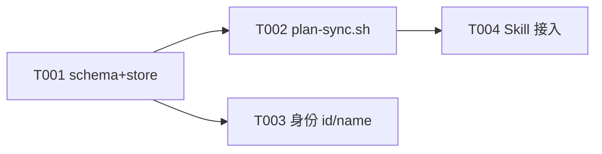

# E002/S001 计划侧入遥测与身份

> 父级 [E002 plan.md](../../plan.md) ・ 实现契约 [design.md](../../design.md)。退出场景锚定：①计划入库与同步、④身份改名与关注持久化。
> 目录规则见 [telemetry/AGENTS.md](../../../../../telemetry/AGENTS.md)。改完跑 `cd telemetry && bun test` + `bash project-template/bin/fpg-check.sh plan-lint <本文>`。

## 终止契约（不可中途放宽）

| 项 | 内容 |
|---|---|
| Definition-of-Done | `plan-sync.sh --dry-run` 能把本仓库 `E002` 目录解析成符合 [design §2.1](../../design.md) 的快照 JSON 并经 collector 入库；改 `actors.display_name` 后 `events.actor_id` 不变、看板显示新名；`bun test` 新增 6 类用例全绿。 |
| DoD 验收证据 | `bun test` 输出 + `plan-sync.sh --dry-run` 对 `test/fixtures` 样例的 JSON + `GET /api/actors` 改名前后对比，留 `evidence/`。 |
| Sprint 预算上限 | 1（硬上限 = 计划 × 1.2 ≈ 1） |
| Token 预算上限 | 80k–150k；硬上限 = 180k（实际看遥测看板） |
| 退出场景 | plan_sync 解析+入库+取最新；身份 id/name 分离+迁移+API |
| 明确不做 | 看板渲染、`/stats` 树（属 S002）；远端鉴权扩展 |
| 外部依赖与责任人 | 无外部依赖；本机 git 可用（算 source）——Allen |

## 结构决策

S001 = 单一退出场景组（数据通路 + 身份）。Task 数 4（含验证合并入各 Task），不再分 Task 子目录；过程记 `worklog.md`、验证证据记 `smoke-report.md`。

## Task 清单与指标

| ID | 名称 | 分类 | 前置 | 可并行 | 状态 | 估计Token | 证据 |
|---|---|---|---|---|---|---|---|
| T001 | schema + store：plan_sync 校验、actors/user_prefs 表与读写 | Must Deliver | — | 否 | 已完成 | 25k–45k | `cd telemetry && bun test`；`bash project-template/bin/fpg-check.sh plan-lint docs/iteration/epics/E002-metrics-refinement/sprints/S001-plan-ingest-identity/plan.md` |
| T002 | plan-sync.sh 解析客户端（--dry-run 可测） | Must Deliver | T001 | 是(与 T003) | 已完成 | 25k–45k | `cd telemetry && bun test`；`bash project-template/bin/fpg-check.sh plan-lint docs/iteration/epics/E002-metrics-refinement/sprints/S001-plan-ingest-identity/plan.md` |
| T003 | 身份 id/name 分离：迁移回填 Allen + /api/actors + install 询问 | Must Deliver | T001 | 是(与 T002) | 已完成 | 20k–35k | `cd telemetry && bun test`；`bash scripts/install.sh --project-dir . --tools codex --telemetry-endpoint http://127.0.0.1:65535 --user test-user --dry-run`；`bash project-template/bin/fpg-check.sh plan-lint docs/iteration/epics/E002-metrics-refinement/sprints/S001-plan-ingest-identity/plan.md` |
| T004 | Skill 接入：sprint-plan/project-requirements 收尾调用 plan-sync.sh | Must Verify | T002 | 否 | 已完成 | 10k–20k | `cd telemetry && bun test`；`bash project-template/bin/fpg-check.sh plan-lint docs/iteration/epics/E002-metrics-refinement/sprints/S001-plan-ingest-identity/plan.md` |

### Task 细则（照做）

- **T001** 改 `telemetry/src/schema.ts`（加 `plan_sync` 与类型 §2.1、`plan_sync` 校验 §2.2）+ `telemetry/src/store.ts`（`migrate()` 加 `actors`/`user_prefs` 表 §4/§5、`latestPlanSnapshots` §2.3、actors/prefs 读写方法、迁移回填 Allen §4）。测试：design §15 用例 1、2、6（actors 迁移/改名/回退）、7（prefs）。
- **T002** 新增 `telemetry/plan-sync.sh`（纯 shell，§3 行为 + §3.1 列解析 + `--dry-run`，永不阻断、exit 0）。新增 `telemetry/test/fixtures/E999-sample/`（一个最小 epic 目录：`plan.md` + `sprints/S001-x/plan.md`）。测试：design §15 用例 9（Bun.spawn 跑 `--dry-run` 断言 JSON）。`emit.sh` 透传确认（预计无需改，若 `--attrs` 大 JSON 转义有问题则修）。
- **T003** 改 `telemetry/src/server.ts`（`/api/actors` GET/PUT §13、鉴权复用）+ `scripts/install.sh`（§14 询问显示名、写 `FPG_ACTOR_NAME`、best-effort PUT）。测试并入 T001 的 actors 用例 + 新增 server 路由用例（改名往返）。
- **T004** 改 `skills/sprint-plan/SKILL.md`、`skills/project-requirements/SKILL.md`：在收尾（plan-lint 之后）调用 `plan-sync.sh --epic-dir <当前Epic> --project <id>`；在 `project-template/references/iteration-governance.md` 或 `execution-card.md` 补一行说明。无新单测（属规范接入），靠 §15 用例 9 的解析正确性背书。

## Mermaid 前序依赖图（Task 关系）

## 并行边界

- T001 是公共前置，必须先合入（动 `schema.ts`/`store.ts`）。
- T002 与 T003 可并行：T002 只加新文件 `plan-sync.sh` + fixtures；T003 改 `server.ts`/`install.sh`。两者不碰同一文件。
- T004 依赖 T002 的客户端就绪。
- 串行冲突文件：`schema.ts`、`store.ts`（仅 T001）、`server.ts`（仅 T003）。总账只更新本 `plan.md` 与 `telemetry/schema.md`。

## 验收标准

- design §15 用例 1、2、6、7、9 全绿；`schema_version` 升 2 且旧事件仍入库（向后兼容）。
- `plan-sync.sh --dry-run` 对 fixtures 输出与 §2.1 结构一致（含 `source`、`deps` 并集、`estimate_tokens` 解析）。
- 改 `actors.display_name` 后 `events` 未变、`resolveName` 返回新名；空 `actors` 表迁移回填 Allen 生效。
- `install.sh` 非交互场景默认 Allen 不卡；交互场景空回车＝Allen。
- `cd telemetry && bun test` 通过；本文件 `plan-lint` 无 STOP。

## 风险与 Backlog

| 项 | 状态 | 优先级 | 复杂度 | 估计Token | 依赖 | 不做的危害 | 验收标准 | 不进当前 Sprint 原因 |
|---|---|---|---|---|---|---|---|---|
| Mermaid 边解析做严格 | 未开始 | P2 | Low | 5k–10k | §3 | deps 漏边 | 边与前置列并集正确 | 前置列已够，Mermaid 为增强 |
