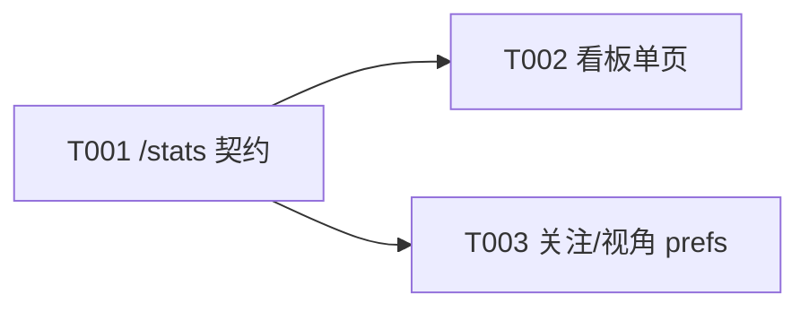

# E002/S002 看板下钻·甘特·关注

> 父级 [E002 plan.md](../../plan.md) ・ 实现契约 [design.md](../../design.md)。退出场景锚定：②下钻看偏差、③并行甘特+关键路径。前置：S001 全部合入。
> 目录规则见 [telemetry/AGENTS.md](../../../../../telemetry/AGENTS.md)。改完跑 `cd telemetry && bun test`。

## 终止契约（不可中途放宽）

| 项 | 内容 |
|---|---|
| Definition-of-Done | 浏览器开 `GET /report`，对本仓库（已有 E001/E002 plan_sync + 真实 turn_complete 归因）能：项目→E→S→T 下钻看到 token 计划/实际/偏差三列、原文链接可点；并行甘特 时/天/周 切换 + 重叠 Epic 分泳道 + 四态图例 + 关键路径行；关注配置存 `/api/prefs` 重开保留。 |
| DoD 验收证据 | `/report` 下钻截图 + 甘特三粒度截图 + `GET /stats` JSON + `/api/prefs` 往返，留 `evidence/`。 |
| Sprint 预算上限 | 1（硬上限 = 计划 × 1.2 ≈ 1） |
| Token 预算上限 | 70k–150k；硬上限 = 180k（实际看遥测看板） |
| 退出场景 | 下钻偏差表；并行甘特+关键路径；关注/视角持久化 |
| 明确不做 | 引入前端框架/构建链；远端多租户鉴权；阶段时长视图 |
| 外部依赖与责任人 | S001 的 `/stats` 数据基础（plan_sync + actors/prefs）——Allen |

## 结构决策

S002 = 看板单一退出场景组。Task 数 3，不分子目录。

## Task 清单与指标

| ID | 名称 | 分类 | 前置 | 可并行 | 状态 | 估计Token | 证据 |
|---|---|---|---|---|---|---|---|
| T001 | /stats 聚合契约：树+维度+甘特+偏差+关键路径+源链接 | Must Deliver | — | 否 | 未开始 | 30k–55k | [design §6,7,9,10](../../design.md) |
| T002 | 看板单页（原生 JS）：总览/下钻/开发者/视角 | Must Deliver | T001 | 是(与 T003) | 未开始 | 30k–60k | [design §11](../../design.md) |
| T003 | 关注/视角 prefs：/api/prefs 路由 + 看板控件接线 | Must Verify | T001 | 是(与 T002) | 未开始 | 15k–35k | [design §5,11,13](../../design.md) |

### Task 细则（照做）

- **T001** 改 `telemetry/src/metrics.ts`：新增 `buildStats(events, {actors, prefs, project, viewer})` 产出 design §6 的 `Stats`；新增 `githubSlug`(§7)、`buildSourceUrl`(§7)、`criticalPath`(§10)、`status4`映射(§8)、`active_hours_by_task` 归集(§6)；保留旧 `computeMetrics`。改 `telemetry/src/server.ts`：`/stats` 调 `buildStats` 并带 `viewer`（actors+prefs join）。测试：design §15 用例 3、4、5、8。
- **T002** 重写 `telemetry/src/dashboard.ts`：输出单页 HTML（内联 style+script，零依赖），`fetch('/stats')` 后渲染 总览（KPI/并行甘特 时-天-周/三维度）、下钻（项目→E→S→T 偏差表+原文）、开发者维度、视角切换。交互可移植本 Epic 已审批原型。测试：`renderDashboard` 对一个 `Stats` fixture 输出含必需锚点（如 `id="gantt"`、`id="v-drill"`、三维度块、关键路径图例）。
- **T003** 改 `telemetry/src/server.ts`：`/api/prefs` GET/PUT(§13)。看板加关注弹窗（多选项目 → PUT prefs）、视角下拉（role_view → KPI 预设与默认筛选，前端）。测试：prefs 路由往返 + 派生默认（并入 S001 用例 7 或新增 server 用例）。

## Mermaid 前序依赖图（Task 关系）

## 并行边界

- T001 先行（定 `/stats` 契约，是看板与 prefs UI 的数据基础）。
- T002 与 T003 可并行：T002 主要写 `dashboard.ts` 渲染；T003 主要写 `server.ts` 路由 + 看板里关注/视角控件。约定 `dashboard.ts` 里 T003 只追加关注/视角片段，合并点由协调线程串行收口。
- 串行冲突文件：`metrics.ts`/`server.ts`（T001 先，T003 后）、`dashboard.ts`（T002 主、T003 增量）。

## 验收标准

- `GET /stats` 输出符合 design §6 形状：三层树、`deviation`（token 有值/工时 null）、`dims` 三维独立含「无」、`gantt.status4/critical/deps`、`source_url`。
- 看板单页零外部依赖、零构建步骤；总览/下钻/开发者/视角/关注全部可用；甘特三粒度 + 分泳道 + 四态图例 + 关键路径行（无依赖时提示「未声明依赖」）。
- 关注配置 PUT 后重开浏览器仍生效（落 `user_prefs`）。
- design §15 用例 3、4、5、8 全绿；`cd telemetry && bun test` 通过；本文件 `plan-lint` 无 STOP。

## 风险与 Backlog

| 项 | 状态 | 优先级 | 复杂度 | 估计Token | 依赖 | 不做的危害 | 验收标准 | 不进当前 Sprint 原因 |
|---|---|---|---|---|---|---|---|---|
| 关键路径精确算法 vs 仅标 Must Deliver | 未开始 | P1 | Medium | 20k–40k | §10 | 关键路径不准 | 与人工标注一致 | §10 已给最长路径算法，足够本 Sprint |
| 看板交互组件化/抽公共渲染 | 搁置 | P3 | Low | 10k–20k | — | 后续维护稍累 | — | 原生单页够用，先交付 |
