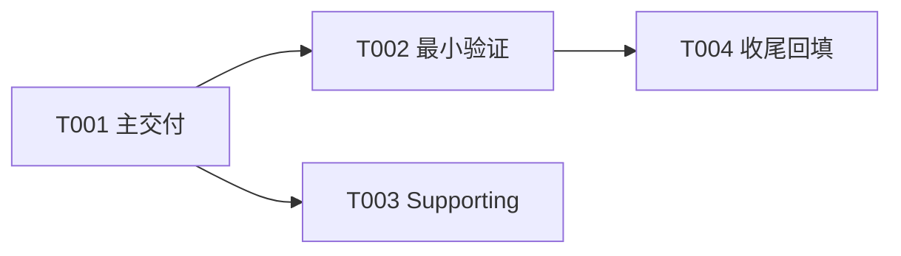

# 迭代治理规范

> 本文件用于 Sprint 规划、开发执行和 QA 验收。目标是让长期迭代可恢复、可并行、可度量，并避免多份清单冲突。

## 1. 层级与编号

用户项目迭代层级统一为：

```text
Epic(E) -> Sprint(S) -> Task(T)
```

- Epic 按创建顺序编号：`E001`、`E002`。
- Sprint 在所属 Epic 内编号：`S001`、`S002`。
- Task 在所属 Sprint 内编号：`T001`、`T002`。
- 目录名必须以编号开头，例如 `E001-user-auth/`、`S001-login-flow/`、`T001-backend-login-api/`。
- 交互输入支持短编号别名：`e1` -> `E001`，`s2` -> `S002`，`t5` -> `T005`，组合输入 `e1-s2-t5` 定位到 `E001/S002/T005`。
- Skill 在执行前必须把短编号归一化为规范编号，并用规范编号扫描目录；如果匹配到多个目录，先列出候选项并让用户确认。
- 用户项目不单独引入 Milestone 层级；Epic 承担阶段目标、范围、验收、跨 Sprint 汇总和 backlog 归集。

## 2. 推荐目录结构

```text
docs/iteration/
  plan.md
  epics/
    E001-epic-name/
      plan.md
      sprints/
        S001-sprint-name/
          plan.md            # 计划 + Task 清单（每 Task 一行，默认不另建目录）+ 指标真源
          worklog.md         # 本 Sprint 唯一过程日志（按 Task 分节）
          smoke-report.md    # 本 Sprint 唯一验证证据（按 Task/场景分节）
          evidence/          # 本 Sprint 一次性证据
          tasks/             # 例外：仅独立上下文边界且产独立证据的 Task 才建目录
            T003-independent-context-task/
              plan.md
              smoke-report.md
              evidence/
```

兼容旧项目：若项目已有 `docs/sprint-N.md`，不要强行迁移历史文件；新 Sprint 优先使用本结构，并在旧文件中留下指向新 `plan.md` 的链接。

## 3. 单一真源规则

每一级只维护一份 `plan.md`，它同时是该级的计划、直接子项清单、状态和指标真源。

| 层级 | `plan.md` 记录内容 |
|---|---|
| `docs/iteration/plan.md` | Epic 清单与 Epic 级汇总指标 |
| `E###/plan.md` | Epic 目标、范围、Sprint 清单与汇总指标 |
| `S###/plan.md` | Sprint 目标、Task 清单（含每 Task 目标/范围/验收/token）、依赖、并行边界、验收标准与汇总指标 |
| `T###/plan.md` | 仅例外独立目录 Task 才有；普通 Task 上述信息写在 Sprint plan 的清单行 |

规则：
- 不新增同级 `INDEX.md`。
- 父级 `plan.md` 只记录直接子级汇总，不复制孙级明细。
- 文档默认落 Sprint 级：`worklog.md` 只记录过程，`smoke-report.md` 只记录验证证据，二者每 Sprint 各一份（按 Task 分节）；状态/token/耗时汇总只回填到对应 `plan.md`。
- 总账文件只能由协调线程更新；子线程只写自己的 Task 目录，除非被明确授权。

## 4. plan.md 必备区块

每一级 `plan.md` 必须包含下级分解清单、关键路径和前序依赖图，便于启动任务时判断并行边界。

| 层级 | 必须包含的下级清单 | 依赖图 |
|---|---|---|
| `docs/iteration/plan.md` | Epic 清单：目标、状态、时间、主动/等待耗时、估计/实际 token、证据 | 可选；多个 Epic 有依赖时必须有 Epic 依赖图 |
| `E###/plan.md` | Sprint 清单：目标、关键路径分类、前置 Sprint、可并行 Sprint、估计/实际 token、证据 | 必须有 Sprint 依赖图 |
| `S###/plan.md` | Task 清单：分类、前置 Task、可并行 Task、估计/实际 token、验收产物/证据 | 必须有 Task 依赖图 |
| `T###/plan.md`（仅例外独立目录 Task） | 子步骤清单：实现步骤、验证步骤、quick check、允许/禁止修改范围 | 复杂 Task 可选；有内部并行时必须有子步骤依赖图 |

下级清单必须包含状态字段，用于表示直接下级当前是否未开始、执行中、已实现、已验证、完成、阻塞或搁置：

```markdown
| ID | 名称 | 分类 | 前置 | 可并行 | 状态 | 估计Token | 实际Token | 验收/证据 |
|---|---|---|---|---|---|---|---|---|
```

依赖图使用 Mermaid：



规则：
- E 级 plan 的依赖图只画 Sprint 关系；S 级 plan 的依赖图只画 Task 关系；T 级 plan 只画内部子步骤关系。
- 图和清单必须表达同一组直接子级；新增、完成、延期下级项时，必须同步更新对应清单和依赖图。
- 依赖图用于判断并行启动：无依赖或依赖已满足的节点才可并行；存在共享文件或共享总账时，即使图上可并行，也必须在清单中标出冲突文件和总账负责人。
- 阶段结束时必须向上回填：Task 结束更新 Sprint `plan.md`；Sprint 结束更新 Epic `plan.md`；Epic 结束更新 `docs/iteration/plan.md`。

## 5. 指标表字段

每个包含子项清单的 `plan.md` 必须包含：

```markdown
| ID | 名称 | 目标 | 状态 | 创建时间 | 开始时间 | 结束时间 | 主动耗时 | 等待耗时 | 估计Token | 实际Token | 偏差原因 | 证据 |
|---|---|---|---|---|---|---|---|---|---|---|---|---|
```

状态使用：

```text
未开始
执行中
阻塞
已实现
已验证
已完成
搁置
```

兼容旧文档时可识别英文别名：`Planned`=`未开始`，`In Progress`=`执行中`，`Blocked`=`阻塞`，`Implemented`=`已实现`，`Verified`=`已验证`，`Done`=`已完成`，`Deferred`=`搁置`。新建和回填必须使用中文状态。

启动规则：
- 创建时写入 `创建时间`、`估计Token` 和初始状态。
- 真正开始执行时写入 `开始时间`，状态改为 `执行中`。

结束规则：
- 结束时写入 `结束时间`、`主动耗时`、`等待耗时`、`实际Token`、`偏差原因`、`证据`。
- `已完成` 只表示实现、验证、报告和父级总账都已更新。
- `搁置` 必须说明为什么不进入当前 Sprint。

状态更新时机：

| 状态 | 何时设置 | 谁更新 | 必须同步的位置 |
|---|---|---|---|
| `未开始` | 规划时创建下级条目 | 规划/协调线程 | 当前层级 `plan.md` 的下级清单 |
| `执行中` | 下级条目被选中并开始执行 | 执行线程或协调线程 | 父级下级清单；写入开始时间 |
| `阻塞` | 遇到无法继续的阻塞 | 执行线程先记录，协调线程确认 | 父级下级清单、Task `worklog.md`、`PROGRESS.md` |
| `已实现` | 代码/文档已完成但未独立验证 | 执行线程 | 父级下级清单、Task `smoke-report.md` |
| `已验证` | 验收命令/smoke/golden case 通过 | QA/独立验收线程 | 父级下级清单、证据链接 |
| `已完成` | 实现、验证、报告、指标、父级汇总都完成 | 协调线程 | 当前层级和上一级 `plan.md` 汇总 |
| `搁置` | 明确移出当前 Sprint/Epic | 协调线程 | 父级下级清单、Backlog 区域、偏差原因 |

任何状态变化都必须只写该层级唯一 `plan.md` 中对应的直接下级行；不得在多个文件维护同一状态副本。下级结束时，必须同时更新自身 `plan.md` 和父级 `plan.md` 的对应行；父级汇总只聚合直接子级状态，不复制孙级明细。

Token 估算必须包含读取上下文、设计、实现、验证、失败排查和文档回填。实际 token 可先人工粗估；偏差原因用任务边界不清、验证失败、环境问题、上下文不足、需求扩大或方案变化等可分析原因描述。

## 6. 关键路径与任务粒度

Sprint 计划必须先识别交付闸门，防止验证框架、文档和过程治理抢占核心编码交付。

| 分类 | 含义 | 处理 |
|---|---|---|
| Must Deliver | 不完成即 Sprint 失败的核心编码或可运行交付 | 优先执行；独立 Task；通常 1-2 个 |
| Must Verify | 证明 Must Deliver 生效的最小验证 | 合并到主 Task 或紧随主 Task；只做关键路径验证 |
| Supporting | 有帮助但不直接改变交付状态 | 限时处理；超预算转 Backlog |
| Backlog | 不明确、低优先级或条件不成熟 | 不进入当前 Sprint 主路径 |

规则：
- Must Deliver 必须排在 Sprint 关键路径最前面，且必须包含能改变交付状态的代码或可运行产物。
- 预计 < 1 小时或 < 10k token 的 smoke、schema、report、check，不建完整 Task 目录；作为 Must Deliver/Must Verify 的验收步骤记录在 `smoke-report.md`。
- **Task 默认是 Sprint `plan.md` 的清单行，不建目录**；只有同时满足「是独立上下文边界（值得单独一次 sprint-develop 调用、与其他 Task 无法共享上下文）」且「产出需留存的独立证据」时，才建 `tasks/T###/`。其余 Task 的过程与验证写进 Sprint 级 `worklog.md`/`smoke-report.md` 的分节。
- **每个 Sprint 的 Task 数 ≤ 4（含验证 Task）**。需要更多 → Sprint 过大或拆得过细：合并同上下文边界的 Task，或拆成两个 Sprint。固定的「每 Task 文档脚手架 + 上下文重载」开销不随 Task 变小而缩小，过度分解会成倍放大治理 token、挤占真正的代码生成。
- **验证集中而非每 Task 重复**：Task 级只记录即时 smoke；完整 parity/回归/golden gate 每 Sprint 末跑一次、Epic 末跑一次，中间 Task 不各自重跑全量回归。
- schema、runner、scenario、diff、redaction 如果共同服务同一个验证目标，优先合并为一个“金标准验证最小闭环”Task；完成最小闭环后再拆增强项。
- Sprint 计划、上下文整理和任务目录准备总 token 不应超过 Sprint 预算的 10%-15%；超限后停止规划，进入 Must Deliver。
- 执行任何 Task 前先问：它是否直接推进 Must Deliver 或 Must Verify？如果不是，只能消耗固定小预算，超出立即停止并转回关键路径。
- token 或时间不足时，按顺序保留：可运行代码、最小验证、必要记录；完整文档、扩展场景、性能和治理项进入 Backlog。
- 验证框架服务于产品交付，不能用“验证框架完成”替代“产品能力可用”。

## 7. Sprint 与 Task 文档

文档默认落在 **Sprint 级**，不再每 Task 一套。每个 Sprint 目录至少包含：

```text
plan.md          # 计划 + Task 清单（每 Task 一行）+ 指标真源
worklog.md       # 全 Sprint 过程日志（按 Task 分节）
smoke-report.md  # 全 Sprint 验证证据（按 Task/场景分节）
evidence/        # 一次性证据
```

普通 Task **不另建目录**：其目标、允许/禁止修改范围、验收标准、估计 token 写在 `S###/plan.md` 的 Task 清单行（或其下方一段），过程记入 Sprint `worklog.md` 对应分节，验证记入 Sprint `smoke-report.md` 对应分节。

**独立目录 Task（例外）**：仅当某 Task 同时是独立上下文边界（值得单独一次 sprint-develop 调用、与其他 Task 无法共享上下文）且产出需留存的独立证据时，才建 `tasks/T###/`，内含 `plan.md`（目标/前置/输入/允许-禁止修改范围/验收/关联链接/估计 token）+ `smoke-report.md` + `evidence/`；其过程日志仍并入 Sprint `worklog.md`。

`worklog.md` 记录时间顺序、命令和关键输出摘要、遇到的问题、临时判断、未解决风险。

`smoke-report.md` 记录每个 Task/场景的 pass/fail/blocked、实际验证命令、关键证据、是否需要升级为代码修复、实际 token、偏差原因。

`evidence/` 只保存一次性验收证据，例如日志、截图、命令输出摘要、脱敏请求/响应样例和临时报告。可复用测试 fixture、golden case、验证脚本、自动化资产不放在 `docs/iteration/` 下，应放到项目的 `tests/fixtures/`、`tests/golden/`、`scripts/` 或约定的测试目录，并在 `smoke-report.md` 中链接。

## 8. 并行任务规则

并行拆分按上下文边界，不按角色机械拆分。

适合并行：
- Desktop smoke 与 Cloud smoke。
- 后端契约实现与前端 mock 实现。
- 独立平台验证。
- 独立 schema 设计与场景用例整理。

不适合并行：
- 同一 Story 的实现和依赖实现细节的紧耦合测试。
- 多个线程同时修改 `PROGRESS.md`、`docs/iteration/plan.md` 或同一个父级 `plan.md`。
- 多个线程同时改同一个 shared runtime 文件。
- 一个任务依赖另一个任务尚未稳定的接口。

Sprint 的 `plan.md` 必须写清前置任务、可并行任务、合并点、共享产物、冲突文件和总账负责人。

## 9. 验证规则

验证分三层：

1. 自动验证：unit、integration、typecheck、lint、OpenAPI/契约校验。
2. 功能验收：真实或准真实场景 smoke。
3. 金标准验收：真实 prompt/payload/response 证据或 golden case 与预期行为比对。

规则：
- 单元测试通过不等于真实可用。
- prompt 或 agent 行为类任务必须有真实场景证据或指向可复用 golden case 的链接。
- evidence 必须脱敏。
- 若 golden case 发现 unit test 未覆盖的问题，必须补测试或记录测试缺口。
- 独立验收线程只做验证和质疑，不复用生成者结论。
- **mock / 结构同构 / 单测通过是必要条件，显式声明不足以单独构成 Epic 的 Definition-of-Done**（见 §10）。

## 10. Epic 终止契约与执行止损闸门

> 规划解决「如何开始」，本节解决「何时停」。详见 `epic-termination-contract.md`（始终随本规范加载）。
> 动机：自治/长程执行没有内建的「停」；缺少硬性终止条件时，agent 会用「产出相邻增量」替代「完成目标」，导致 Epic 永不收口的反刍循环。

强制规则（违反即停，升级人类）：

1. **终止契约前置**：每个 Epic 在 `sprint-plan` 创建时必须在 `E###/plan.md` 写入「终止契约」区块——不可变 DoD（绑定真实用户可观测结果）、Sprint/Token 预算上限、退出场景、明确不做（out-of-scope）、最硬外部依赖与责任人。
2. **预算熔断**：实际 Sprint 数或累计 Token 触及硬上限（计划 × 1.2）自动 STOP，进人类 re-baseline，不得自行开新 Sprint。
3. **外部阻塞升级**：阻塞于执行者当前无法获得的依赖（账号/环境/数据/审批）= 终态 `blocked-external` → 停 + 升级，**禁止派生相邻工作**（不准为跑不了的测试造 preflight/evidence/safety gate/dry-run/分类器）。
4. **范围守卫**：每个新 Sprint 必须追溯到 Epic 某条成功标准；追溯不到、或属于 out-of-scope、或只是「补一个非 DoD 的未覆盖点」→ 不立项，转 Backlog。
5. **自治 stop-gate**：agent 不得自我授权 Sprint N+1；连续 N 个 Sprint（默认 2）未让任一退出场景从红转绿（只产出文档/测试/脚手架）→ 强制停。
6. **闸门 no-go 归因**：区分「内部可修 / 外部不可得 / 范围外」；外部不可得不得用「再来一个 Sprint」消化；严禁为刷绿闸门放宽契约或跳过负向场景。

## 11. 结构深度闸门（层级按退出场景伸缩，规划期一次定死）

> 动机：§10 防「蔓延」（失控地加 Sprint）；本节防对称的另一面「碎片化」（拆出大量薄到不做事的 Sprint/Task，固定治理开销被成倍放大、挤占真正的代码生成）。两者同根——都在优化流程产物而非交付物。
> 原则：用尽量少的层级装下交付物；层级深度在**规划期由客观触发器一次判定、写进 plan、冻结**；执行期只读冻结结构，不再判断（消除"每次选层数"的歧义与钻空子空间）。

强制规则（违反即停，升级人类）：

1. **深度由退出场景决定，不靠体感**：
   - **Sprint 层**仅当 Epic 有 **≥2 个能独立通过/失败的退出场景（验证里程碑）**时才设；否则**扁平**——Epic `plan.md` 直接挂执行切片清单，无 Sprint 层。
   - **1 个 Sprint == 1 个独立退出场景**（或一组必须一起验证的退出场景）。薄到没有自己能独立转绿的退出场景的 Sprint → 不立项，合并到相邻 Sprint。「某 Sprint 不做事」即此信号。
   - **Task 目录**仅当该单元既是独立上下文边界、又产需留存的独立证据时才建（见 §6/§7）；否则为清单行。
2. **数量锚定退出场景，防钻空子**：活跃 Sprint 数不得超过 Epic 独立退出场景数；不得通过「少套一层」逃过 Must Verify 闸门——独立验证里程碑的数量**直接数 Epic `plan.md` 已写的退出场景**，不是自由心证。
3. **规划期一次定死 + 冻结**：`sprint-plan` 创建/重启/re-baseline Epic 时，按本节判定结构深度并写入 Epic `plan.md`「结构决策」一行（扁平 / Epic+N Sprint，并写明 N 锚定哪几条退出场景）。执行期不得重新判断层数。改结构深度 = 与改预算上限同级的 re-baseline，须人类批准并记录。
4. **终止契约不可省**：无论扁平还是多层，每个 Epic 都必须有终止契约（§10）；扁平小 plan 也要写 DoD / 预算上限 / 杀死条件。
5. **跨 Epic 拆分优先于 Sprint 增殖**：把独立、可搁置（park）的交付物拆成**独立 Epic** 成本低（只花一份 plan，不产生执行期开销）；在活跃 Epic 内**增殖薄 Sprint** 成本高（每个多一道验证闸门 + 一套文档 + 一次上下文重载）。优先前者，警惕后者；合并按实现轴（而非能力里程碑）拆出的相邻 Sprint。
