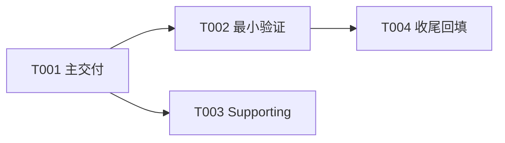

# Sprint 计划

## Sprint 信息

| 项目 | 内容 |
|------|------|
| Sprint 编号 | Sprint {{N}} |
| Sprint 目标 | {{GOAL}} |
| 持续时间 | {{DURATION}} |
| 涉及平台 | Backend / iOS / Android / Web |

---

## Sprint 目标

<!-- 用一句话描述本 Sprint 要达成的核心目标 -->

---

## 关键路径与任务分类

| 分类 | 任务 | 为什么属于该分类 | Token 预算 | 完成标准 |
|------|------|------------------|------------|----------|
| Must Deliver | | 不完成则本 Sprint 失败 | | 可运行交付 / 代码提交 |
| Must Verify | | 证明 Must Deliver 生效 | | 最小 smoke/test/evidence |
| Supporting | | 有帮助但不改变交付状态 | | 限时处理 |
| Backlog | | 不明确、低优先级或条件不成熟 | | 移出本 Sprint 主路径 |

> 规则：预计 < 1 小时或 < 10k token 的 smoke/schema/report/check 不单独建完整 Task 目录，合并到 Must Deliver 或 Must Verify 的验收步骤。

---

## User Stories

### US-{{N}}-001: {{Story Title}}

**描述**: 作为 {{角色}}，我希望 {{功能}}，以便 {{价值}}

**优先级**: P0 / P1 / P2

**验收标准**:
- [ ] AC-1:
- [ ] AC-2:

**技术任务分解**:

| 任务 | 分类 | 平台 | 描述 | 预估复杂度 | 估计Token用量 | 实际Token用量 |
|------|------|------|------|-----------|---------------|---------------|
| T-001 | Must Deliver / Must Verify / Supporting | Backend | | S/M/L | | TBD |
| T-002 | Must Deliver / Must Verify / Supporting | iOS | | S/M/L | | TBD |
| T-003 | Must Deliver / Must Verify / Supporting | Web | | S/M/L | | TBD |

---

## 任务清单与复杂度

| ID | 名称 | 分类 | 前置 | 可并行 | 状态 | 估计Token | 实际Token | 验收/证据 |
|---|---|---|---|---|---|---|---|---|
| T001 | | Must Deliver / Must Verify / Supporting / Backlog | 无 | 否 | 未开始 | | TBD | |
| T002 | | Must Deliver / Must Verify / Supporting / Backlog | T001 | 可与 T003 并行 | 未开始 | | TBD | |

---

## 依赖与并行甬道图

> 图和任务清单必须表达同一组直接 Task；启动并行任务前先确认前置已满足、冲突文件已标出、总账负责人唯一。

---

## API 变更清单

| Method | Path | 变更类型 | 关联 Story |
|--------|------|----------|-----------|
| | | 新增/修改/删除 | US-N-001 |

---

## 数据库变更

| 表名 | 变更类型 | 描述 |
|------|----------|------|
| | 新建/修改 | |

---

## 依赖与风险

| 项目 | 描述 | 缓解措施 |
|------|------|----------|
| | | |

---

## Sprint 评审检查项

- [ ] 所有 Story 验收标准通过
- [ ] API 契约与 OpenAPI 文档同步
- [ ] 后端单元测试覆盖新增代码
- [ ] 客户端可正常调用新 API
- [ ] 无新增安全漏洞
- [ ] 代码已提交并通过 CI
