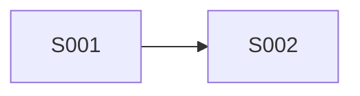

# E999 样例 Epic

## 终止契约

| 项 | 内容 |
|---|---|
| Token 预算上限 | 10k-20k |

## Sprint 清单与指标

| ID | 名称 | 分类 | 前置 | 可并行 | 状态 | 估计Token | 估计工时 | 证据 |
|---|---|---|---|---|---|---|---|---|
| S001 | Build Core | Must Deliver | — | 否 | In Progress | 2k-4k | 3h | [plan](sprints/S001-build/plan.md) |
| S002 | Verify Core | Must Verify | S001 | 否 | 未开始 | 500~1k | 1.5 | [plan](sprints/S002-verify/plan.md) |

## Mermaid 前序依赖图

