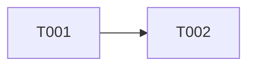

# S001 Build Core

## Task 清单与指标

| ID | 名称 | 分类 | 前置 | 可并行 | 状态 | 估计Token | 估计工时 | 证据 |
|---|---|---|---|---|---|---|---|---|
| T001 | Parse Tables | Must Deliver | — | 否 | 已完成 | 300-600 | 2 | test |
| T002 | Merge Mermaid | Supporting | T001 | 是 | 阻塞 | 1k-2k | 0.5h | test |

## Mermaid 前序依赖图

